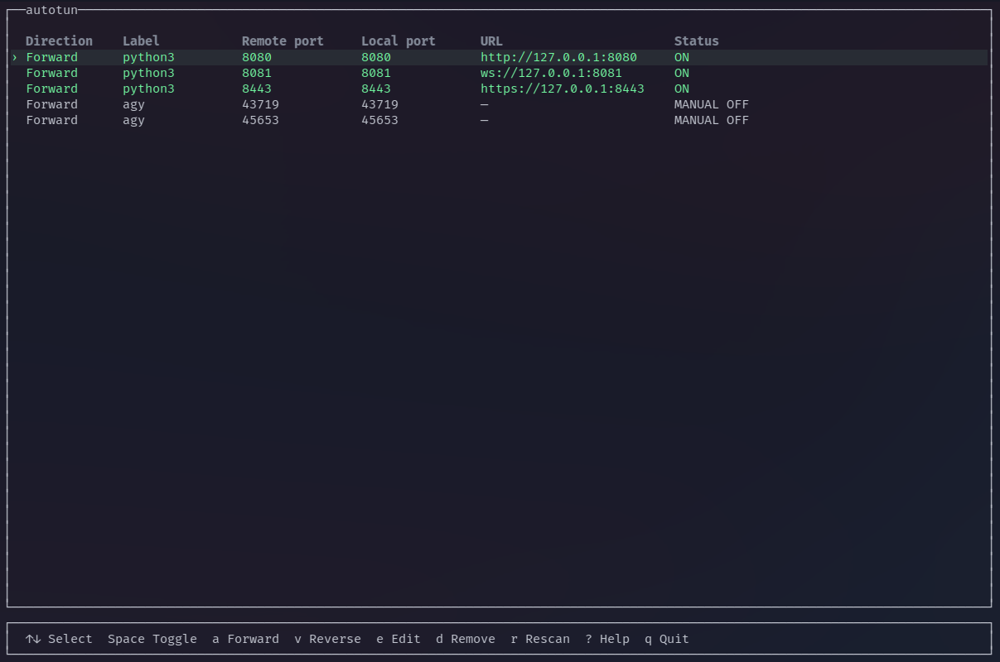
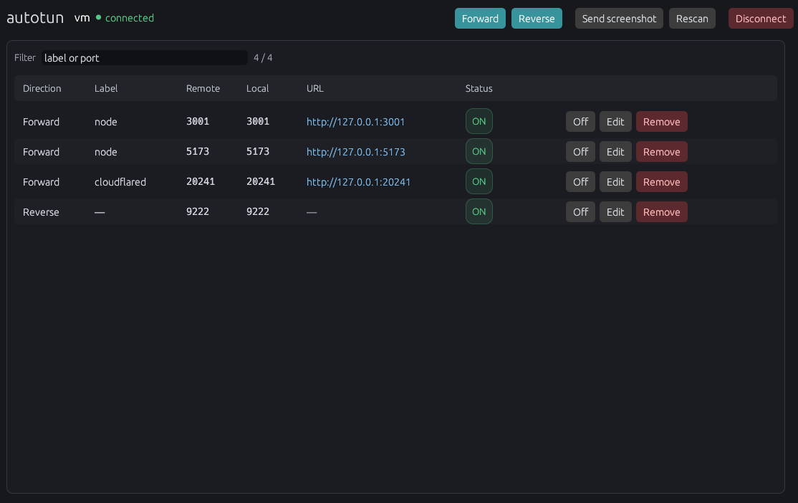

#  autotun

[](https://github.com/thuanlm215/autotun/actions/workflows/ci.yml)
[](https://github.com/thuanlm215/autotun/releases/latest)
[](LICENSE)

`autotun` is a terminal UI (and optional desktop GUI) for discovering and
managing SSH port forwards over a single OpenSSH connection. It watches TCP
listeners on a remote host, forwards them to local loopback by default, and
lets you add, edit, toggle, or reverse tunnels without reconnecting. It can
also send a local screenshot to the remote host as a file so you can paste
the path into an SSH AI CLI.

Existing SSH configuration works as usual: aliases, keys, agents, `ProxyJump`,
and custom options.





## Features

- Discovers remote TCP listeners and auto-forwards them (see
  [Discovery](#discovery)).
- Labels tunnels from remote process names when `ss -p` can see them.
- Detects application protocols (`tcp`, `http`, `https`, `ws`) and shows
  scheme-prefixed local URLs for open forwards.
- Supports **forward** (`-L`, remote → local) and **reverse** (`-R`, local →
  remote) tunnels.
- Adds and cancels forwards on one ControlMaster session (no extra SSH
  transports).
- Rescans remote listeners in the background and tracks service lifecycle.
- Restores previously enabled tunnels after an SSH reconnect.
- Resolves local bind conflicts by trying the next five ports.
- Inline multi-line add/edit forms; help bar toggle with `?`.
- Forwards a local clipboard PNG to `/tmp/autotun-clip-*.png` on the remote
  host (`p` / **Send screenshot** / `autotun clip`) for pasting into an AI CLI.
- In the desktop GUI, launches remote Wayland applications through Waypipe so
  their windows appear on the local desktop.
- Static Linux binaries for x86-64 and ARM64. Optional desktop GUI.

## Installation

### Install script

The installer detects the host architecture, downloads the latest release,
verifies its SHA-256 checksum, and installs `autotun` to
`$HOME/.local/bin/autotun`:

```sh
curl -fsSL https://raw.githubusercontent.com/thuanlm215/autotun/main/install.sh | sh
```

If `$HOME/.local/bin` is not on your `PATH`, add it in your shell config or run
`$HOME/.local/bin/autotun` directly.

Install a specific version or choose another destination:

```sh
curl -fsSL https://raw.githubusercontent.com/thuanlm215/autotun/main/install.sh \
  | AUTOTUN_VERSION=1.2.0 AUTOTUN_INSTALL_DIR="$HOME/bin" sh
```

Download and inspect the script first if you prefer not to pipe to `sh`:

```sh
curl -fsSLO https://raw.githubusercontent.com/thuanlm215/autotun/main/install.sh
less install.sh
sh install.sh
```

Archives and checksums are on the
[GitHub Releases page](https://github.com/thuanlm215/autotun/releases/latest).

### Build from source

Requires Rust and OpenSSH:

```sh
cargo install --git https://github.com/thuanlm215/autotun --locked
```

Or from a checkout:

```sh
cargo build --release --locked
install -Dm755 target/release/autotun "$HOME/.local/bin/autotun"
```

## Usage

```sh
autotun user@example.com
autotun development-server
```

Discover without auto-forwarding:

```sh
autotun development-server --no-auto-forward
```

Scan interval (default 3 seconds):

```sh
autotun development-server --interval 5
```

Reverse forwards at startup, or extra OpenSSH options:

```sh
autotun development-server -R 3000 -R 8080
autotun development-server --ssh-arg=-J --ssh-arg=bastion.example.com
```

Desktop GUI (same installer; extra binary, no extra packages on a normal Linux desktop):

```sh
autotun --gui
autotun --gui development-server
```

The installer also adds an application menu entry. `autotun host` still opens
the TUI.

### Remote Wayland apps (desktop GUI)

`autotun --gui` can run a graphical application on the remote host and display
its window on the local desktop using [Waypipe](https://gitlab.freedesktop.org/mstoeckl/waypipe/).
This is GUI-only; the TUI deliberately does not manage graphical applications.

The local machine must be running a Wayland session, and `waypipe` must be
installed on **both** the local machine and the remote host. Autotun only checks
these prerequisites; it never installs packages or runs `sudo`.

```sh
# Debian/Ubuntu, run once on each machine
sudo apt install waypipe

# Arch, run once on each machine
sudo pacman -S waypipe
```

Connect in the GUI, enter a command such as `firefox --new-instance` in
**Remote Wayland Apps**, then select **Launch**. The command is parsed into an
argument vector rather than run through a shell, so shell syntax such as `|`,
`>`, and `&&` is not supported. Multiple apps can run at once; **Stop** ends
the local Waypipe/SSH process for that app. Autotun stops all launched apps on
Disconnect or when the GUI exits, and does not restart or preserve them.
Finished entries are cleared automatically on the next launch; diagnostics are
collapsed by default and can also be removed with **Clear finished**. Autotun
uses Waypipe's `--no-gpu` mode for compatibility with headless VMs that do not
provide an accessible DRM render node.

Waypipe reuses autotun's authenticated OpenSSH ControlMaster, so SSH aliases,
keys, agents, `ProxyJump`, and `--ssh-arg` options used to create the session
continue to apply. It requires OpenSSH support for Unix-socket forwarding.

Some desktop applications reuse an already-running instance and may open a
window on the remote desktop instead. Use that application's new-instance or
new-profile option when available (for example, `firefox --new-instance`).
Waypipe is intended for Wayland clients; X11-only apps, desktop persistence,
and reconnecting an app after an SSH outage are outside this MVP.

### Clipboard image → remote AI CLI

Konsole cannot paste a screenshot into an SSH PTY. Autotun uploads the PNG
instead and puts the remote path on your clipboard so you paste **text** into
the CLI (Claude Code, Aider, …).

```sh
# While autotun is connected, from another local terminal or a KDE shortcut:
autotun clip

# Or name the host (uses the live ControlMaster when it matches):
autotun clip development-server
```

Then `Ctrl+Shift+V` in the SSH CLI. The file is `/tmp/autotun-clip-<time>.png`;
`/tmp/autotun-clip.png` always points at the latest. In the TUI press `p`; in
the GUI use **Send screenshot**. A notice shows the path or the error;
it clears after a few seconds, or immediately with `?` / `Esc`.

KDE Plasma does not ship a CLI clipboard tool. Install one on the **local**
machine:

```sh
# Wayland (typical Plasma)
sudo pacman -S wl-clipboard

# X11, or as a fallback
sudo pacman -S xclip
```

Run `autotun --help` for the full CLI reference.

## Controls

Help is shown by default. Press `?` to hide or show it.

| Key | Action |
| --- | --- |
| `↑` / `↓`, `j` / `k` | Move selection |
| `Space` | Toggle the selected tunnel on or off |
| `Enter`, `e` | Edit the selected tunnel (inline form) |
| `a` | Add a **forward** (remote → local, `-L`) |
| `v` | Add a **reverse** (local → remote, `-R`) |
| `d` | Remove a manual tunnel, or ignore a discovered one for this session |
| `r` | Rescan remote listeners now |
| `p` | Send the local clipboard image to the remote host and copy the path |
| `c` | Copy the selected tunnel URL |
| `/` | Filter |
| `?` | Toggle the help bar |
| `q`, `Ctrl+C` | Close tunnels and exit |

`Esc` cancels an open form. It does **not** quit the app.

### Add / edit form

The form opens under the table (one field per line). Field focus is highlighted.

| Key | Action |
| --- | --- |
| `↑` / `↓` | Move between fields |
| `Enter` | Next field, or save on the last field |
| `Esc` | Cancel |

While the form is open, the footer shows form help instead of the main shortcut
list.

### Table columns

| Column | Meaning |
| --- | --- |
| Direction | `Forward` (remote → local) or `Reverse` (local → remote) |
| Label | Process name from remote `ss -p`, or a label you set |
| Remote port | Port on the remote side of the mapping |
| Local port | Port on the local side of the mapping |
| URL | Local URL when a forward is on, with detected scheme |
| Status | `ON`, `off`, `MANUAL OFF`, `TARGET DOWN`, or an error |

## Discovery

Autotun runs remote `ss -lntp` (falls back to `ss -lnt` / `netstat`). A port is
discovered when:

- the port is **greater than 1024**, or
- the port is a well-known application listener: **80** or **443**

Infrastructure ports such as `22` (ssh) and `53` (DNS) are not auto-discovered.
You can still forward any port (including those) with `a` / `v` or `-R`.

Remote listeners created by an **enabled reverse** tunnel are not re-discovered
as forwards. Otherwise reverse-forwarding local Chrome DevTools (`9222`) would
immediately open a second forward back to your machine.

Loopback-only listeners (`127.0.0.1`, `::1`) are included by default
(`--include-loopback`).

## Forwarding behavior

### Forward (remote → local)

For a remote service on port `3000`, autotun prefers:

```text
local 127.0.0.1:3000  →  remote 127.0.0.1:3000
```

If local `3000` cannot be bound, it tries `3001` … `3005`. If none work, the
row stays visible with an error in Status.

### Reverse (local → remote)

Reverse tunnels are never discovered. Add them with `v` or `--reverse` / `-R`:

```text
remote 127.0.0.1:8080  →  local 127.0.0.1:8080
```

### Lifecycle

- Scans run every three seconds by default.
- A remote service must be missing for **two consecutive successful** scans
  before the tunnel is marked `TARGET DOWN` and an active forward is cancelled.
- Failed scans do not remove tunnels.
- If a service returns and auto-forward is on, the tunnel is re-enabled **unless**
  you turned it off with `Space` (`MANUAL OFF`). Manual-off survives service
  restart until you enable the tunnel again or remove it with `d`.
- Ignoring a discovered tunnel with `d` also sets manual-off for the session.
- Settings are session-only; nothing is persisted per host.

### Protocol and URL

After a forward is enabled, autotun probes the local bind and classifies:

| Protocol | How it is detected |
| --- | --- |
| `https` | TLS ServerHello / alert |
| `ws` | HTTP `101 Switching Protocols` |
| `http` | HTTP response |
| `tcp` | Default (no higher-level match) |

The URL column shows values such as `https://127.0.0.1:443` or
`tcp://127.0.0.1:5432` so terminals can Ctrl/Cmd-click them. Reverse tunnels do
not show a local URL.

Binding local privileged ports (`80`, `443`, …) may require elevated rights on
your machine; if the preferred port fails, the usual port fallback applies.

## How it works

```text
autotun
   └── one SSH ControlMaster transport
       ├── remote listener scans (ss / netstat)
       ├── local forwards (-L)
       └── reverse forwards (-R)
```

No remote agent, daemon, elevated install, or config file is required on the
server.

## Requirements and compatibility

- Linux x86-64 or ARM64 for prebuilt binaries (other targets: build from source).
- Local OpenSSH client (`ssh`).
- Remote `ss` (iproute2) or `netstat`.
- Remote SSH server allows TCP forwarding.

## Security

- Forwards bind to `127.0.0.1` only; they are not published on the LAN or WAN.
- Reverse forwards are always explicit (`v` or `-R`).
- The install script verifies published SHA-256 checksums.
- Authentication and host keys are handled by OpenSSH.

## Development

```sh
cargo fmt --check
cargo test --locked
cargo clippy --locked --all-targets -- -D warnings
tests/install.sh
cargo check --locked --features gui --bins
```

Optional live SSH tests (need network and credentials):

```sh
AUTOTUN_SSH_TEST=1 AUTOTUN_SSH_DEST=user@host \
  cargo test --locked --test ssh_lifecycle -- --nocapture
```

## License

Licensed under the [MIT License](LICENSE).
